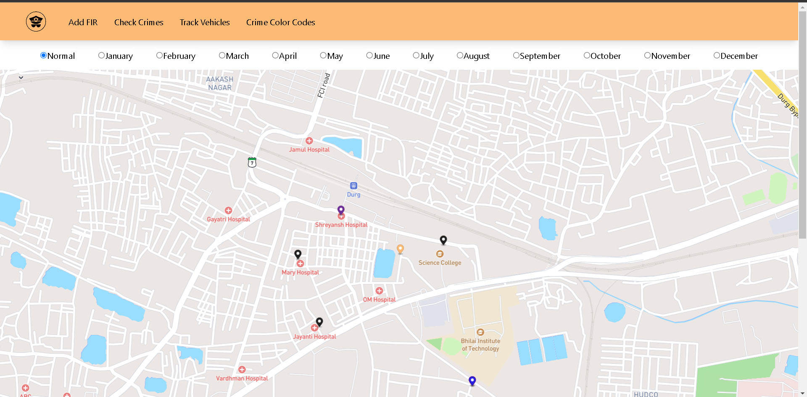
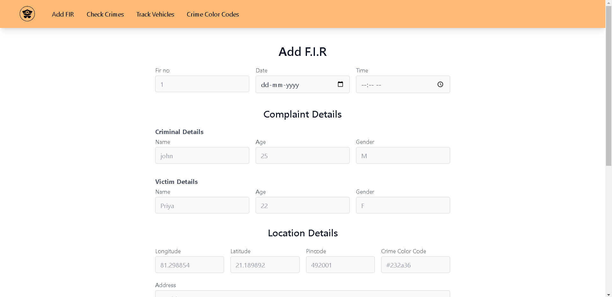

# Crime Mapping (Interactive data visualizer)

Created a website for Police to track crime record visually on Map, based on the previous crime. It maps crime on the basis of previous FIR details

## Technology Used :
* Next.js 
* Tailwind Css 
* Strapi 
* JavaScript 
* Node.js 
* PostgreSQL

## Images:

<!-- [Link to the Project](https://vmartfrontend.onrender.com/ "V-Mart") -->    

