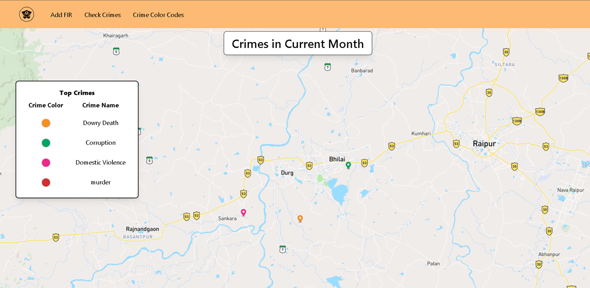
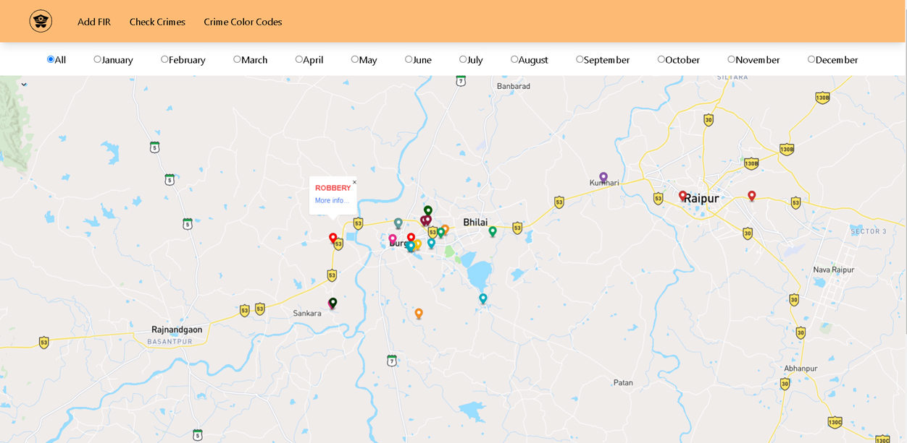
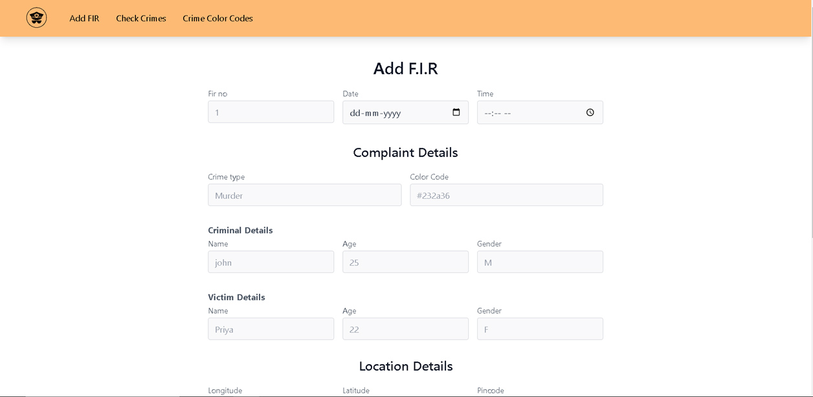

# Crime Mapping (Interactive data visualizer)

Created a website for Police to track crime record visually on Map, based on the previous crime. It maps crime on the basis of previous FIR details

## Technology Used :
* Next.js 
* Tailwind Css 
* Strapi 
* JavaScript 
* Node.js 
* PostgreSQL

## Demo Video :
https://github.com/Harsh-bhai/crime-mapping/assets/107921110/3a59b011-995c-448a-9add-d8167ed9fc3f

## Images:

